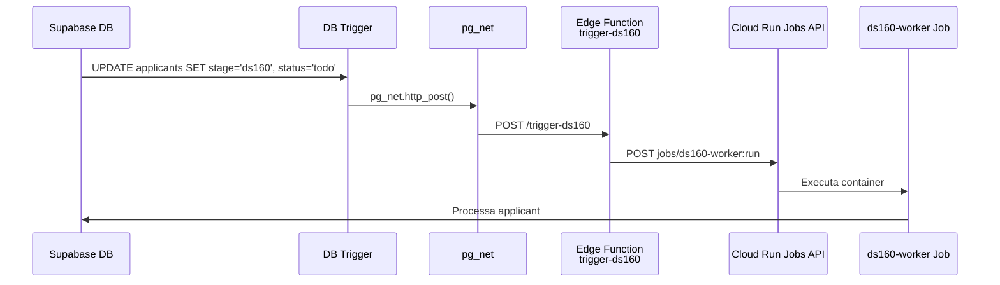

# Webhook Automático: Supabase → Cloud Run Job

Quando um applicant avança para `stage = 'ds160'` com `status = 'todo'`, o sistema dispara automaticamente o Cloud Run Job para processá-lo.

## Arquitetura



## Proposed Changes

### Supabase Database

#### 1. Habilitar extensão `pg_net`
```sql
CREATE EXTENSION IF NOT EXISTS pg_net;
```

#### 2. Criar função trigger
```sql
CREATE OR REPLACE FUNCTION notify_ds160_job()
RETURNS TRIGGER AS $$
BEGIN
  IF NEW.stage = 'ds160' AND NEW.status = 'todo'
     AND (OLD.stage IS DISTINCT FROM 'ds160' OR OLD.status IS DISTINCT FROM 'todo') THEN
    PERFORM net.http_post(
      url := current_setting('app.supabase_url') || '/functions/v1/trigger-ds160',
      headers := jsonb_build_object(
        'Content-Type', 'application/json',
        'Authorization', 'Bearer ' || current_setting('app.service_role_key')
      ),
      body := jsonb_build_object(
        'applicant_id', NEW.id,
        'full_name', NEW.full_name,
        'company_id', NEW.company_id
      )
    );
  END IF;
  RETURN NEW;
END;
$$ LANGUAGE plpgsql SECURITY DEFINER;
```

#### 3. Criar trigger na tabela `applicants`
```sql
CREATE TRIGGER trg_ds160_auto_job
  AFTER UPDATE ON applicants
  FOR EACH ROW
  EXECUTE FUNCTION notify_ds160_job();
```

---

### Supabase Edge Function

#### [NEW] `trigger-ds160` (Edge Function)

Recebe POST do DB trigger e chama a Cloud Run Jobs API:
- Valida `Authorization` header (service role key)
- Chama `POST https://run.googleapis.com/v2/projects/{project}/locations/{region}/jobs/{job}:run`
- Usa Google OAuth2 com service account credentials
- Log da execução no console

> [!IMPORTANT]
> Requer que os seguintes **Supabase Secrets** estejam configurados:
> - `GCP_PROJECT_ID` — ID do projeto GCP
> - `GCP_SA_KEY` — JSON da service account (mesma do GitHub Actions)

---

### CI/CD

#### [MODIFY] [.github/workflows/deploy.yml](file:///c:/Users/azuos/Desktop/DS160%20IA/.github/workflows/deploy.yml)
Nenhuma mudança necessária — o Cloud Run Job já é deployado automaticamente. Basta garantir que os secrets GCP estão configurados no GitHub.

---

## User Review Required

> [!IMPORTANT]
> **Secrets necessários no Supabase:**
> - A Edge Function precisa do `GCP_SA_KEY` (JSON da service account GCP) como secret
> - Também precisa do `GCP_PROJECT_ID`
> - Você tem acesso a esses valores? Estão nos secrets do GitHub Actions?

> [!WARNING]
> **`pg_net` + `app.settings`:** O trigger usa `current_setting('app.supabase_url')` e `current_setting('app.service_role_key')`. Esses são automaticamente disponíveis no Supabase, mas precisamos confirmar no deploy.

## Verification Plan

### Automated Tests
1. Testar a Edge Function localmente via `curl`
2. Simular UPDATE no banco e verificar que o job é executado
3. Monitorar logs do Cloud Run para confirmar execução

### Manual Verification
1. Mudar um applicant para `stage='ds160', status='todo'` via dashboard
2. Verificar nos logs do Supabase Edge Function se recebeu o webhook
3. Verificar no Cloud Run se o job foi executado
