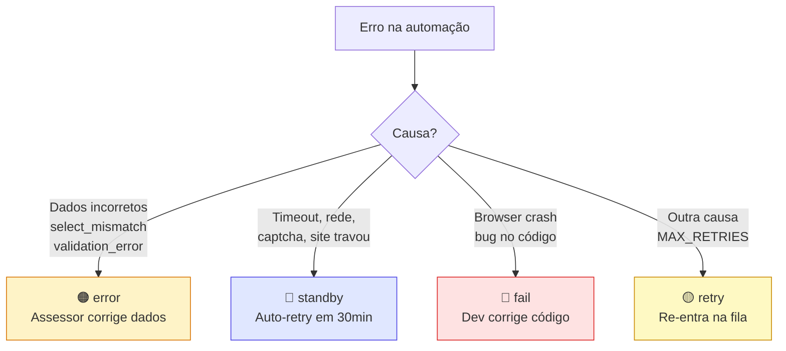

# Documentação — Status, Etapas e Automação DS-160

## 1. Status e Responsabilidades

| Status | Label | Cor | Responsável | Visível em |
|---|---|---|---|---|
| `todo` | Pendente | ⚪ Cinza | — | Lista da etapa |
| `doing` | Em execução | 🔵 Azul pulsante | Automação | Lista da etapa |
| `done` | Concluído | 🟢 Verde | Automação/Manual | Oculto (auto-avança) |
| `retry` | Repetir | 🟡 Amarelo | Automação | Lista da etapa (topo) |
| `standby` | Em espera | 🔵 Índigo pulsante | Site do governo | Lista da etapa |
| [error](file:///c:/Users/azuos/Desktop/DS160%20IA/public/ds160-form.html#794-809) | Erro de dados | 🟠 Laranja | Assessor | Processos com Problemas |
| `fail` | Falha técnica | 🔴 Vermelho | Desenvolvedor | Processos com Problemas |

## 2. Classificação de Erros

### Causas por categoria

| Categoria | Causas | Status final |
|---|---|---|
| **Dados** | `missing_data`, `validation_error`, `select_mismatch`, `invalid_field_value` | [error](file:///c:/Users/azuos/Desktop/DS160%20IA/public/ds160-form.html#794-809) |
| **Site** | `timeout`, `network_error`, `page_stuck`, `postback_stuck`, `captcha_failed`, `session_expired` | `standby` |
| **Técnica** | `browser_closed` | `fail` |
| **Outra** | Qualquer causa não classificada | `retry` |

## 3. Fluxo de Etapas

| Etapa | Trigger de Avanço | Status na próxima |
|---|---|---|
| **Triagem** | Form 100% (auto) | Pendente |
| **Análise** | Assessor → done (manual) | Pendente |
| **DS-160** | Automação/manual → done | Pendente |
| **Taxas** | done | Pendente |
| **Agendamento** | done | Pendente |
| **Entrevista** | Resultado (aprovado/negado/etc.) | O próprio resultado |
| **Resultado** | Fim do fluxo | — |

## 4. Visibilidade nas Listas

### Listas de Etapas (ordenação por prioridade)

| Prioridade | Status | Descrição |
|---|---|---|
| 🔴 1° (topo) | `retry` | Falhou, re-processando |
| 🔵 2° | `standby` | Aguardando site (auto-retry 30min) |
| 🟡 3° | `doing` | Automação em andamento |
| ⚪ 4° | `todo` | Aguardando processamento |

> Dentro do mesmo status: `sort_order` → `created_at`

### Processos com Problemas (Dashboard)

| Prioridade | Status | Descrição |
|---|---|---|
| 🟠 1° | [error](file:///c:/Users/azuos/Desktop/DS160%20IA/public/ds160-form.html#794-809) | Erro de dados (assessor) |
| 🔴 2° | `fail` | Falha técnica (dev) |

### Não aparece nas listas
- `done` → auto-avança para próxima etapa
- [error](file:///c:/Users/azuos/Desktop/DS160%20IA/public/ds160-form.html#794-809)/`fail` → Processos com Problemas

## 5. Proteções Anti-Zumbi

| Mecanismo | Timeout | Ação |
|---|---|---|
| Stale Detection | >10min em `filling` | Reseta para `todo` |
| Orphan Recovery | `filling` sem `started_at` | Reseta para `todo` |
| Safety Net | Loop termina sem resolver | Marca `retry` |
| Catch no Loop | Exception inesperada | Marca `fail` |
| Standby Cooldown | 30min após `standby` | Auto-retry |

## 6. Gráfico do Dashboard

O gráfico stacked mostra 4 segmentos:
- 🟢 **Sob controle** — todo, doing, retry, done
- 🟠 **Erro de dados** — error
- 🔴 **Falha técnica** — fail

## 7. Regras recentes de operação

- O assessor visualiza logs por `application_id`, com screenshot da falha quando disponível
- `error` é correção de dados; `standby` é espera com retry automático; `fail` para o fluxo até revisão técnica
- Grupos só aceitam vínculo na mesma etapa e só andam quando todos concluem juntos
- Exclusão permanente só existe para processos já arquivados
- 🔵 **Em espera** — standby
